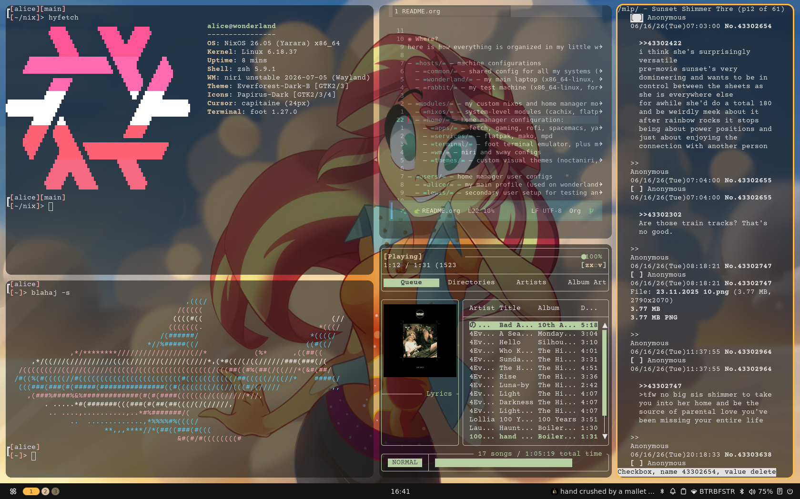

#+author: Alice Liddell
#+options: toc:nil

caption: screenshot of noctaniri  

* What?
my main nixos configuration! this is what runs my cozy daily setup on wonderland (my main laptop) and rabbit (my test machine) ♡

i like niri :3

* Why?
wouldnt you like to know!

* Where?
here is how everything is organized in my little wonderland:

- =hosts/= — machine configurations
  - =common/= — shared config for all my systems (base config, users, audio, custom fonts, openssh, etc.)
  - =wonderland/= — my main laptop (x86_64-linux, cozy swayfx/niri desktop setup)
  - =rabbit/= — my test machine (x86_64-linux, for experimenting without breaking things!)

- =modules/= — my custom nixos and home manager modules
  - =nixos/= — system-level modules (cachix, flatpak, tor, etc.)
  - =home/= — home manager configuration:
    - =apps/= — fetch, gaming, rofi, spacemacs, yazi, zen, etc.
    - =services/= — flatpak, mako, mpd
    - =terminal/= — foot terminal emulator, plus my shell & multiplexer setup (zsh, tmux, zellij)
    - =wm/= — niri and sway configs
    - =themes/= — custom visual themes (noctaniri, pureniri, loveniri, etc.)

- =users/= — home manager user configs
  - =alice/= — my main profile (used on wonderland and rabbit)
  - =lewis/= — secondary user setup for testing and multitasking

- =secrets/= — sops-encrypted secrets (ssh keys, passwords, wifi configurations, etc.)

* How?

** Quickstart (for me ofc)
if i ever need to rebuild my system in a hurry:
#+begin_src sh
  git clone https://codeberg.org/sheep/nix.git
  cd nix
  nixsw
#+end_src

** Installing on a new machine (or new user setup)
you need your own age key so you can decrypt and re-encrypt the secrets.

*** 1. generate an age key
#+begin_src sh
  age-keygen -o ~/.config/sops/age/keys.txt
  # write down the public key printed — you'll need it!
#+end_src

*** 2. add your public key to .sops.yaml
edit =.sops.yaml= and replace my public key with your own:
#+begin_src yaml
  keys:
    - &admin age1YOUR_PUBLIC_KEY_HERE
  creation_rules:
    - path_regex: secrets/[^/]+\.(yaml|json|env|ini)$
      key_groups:
      - age:
        - *admin
#+end_src

*** 3. create your secrets.yaml
my actual secrets are ignored by git, so you should create your own using the template:
#+begin_src sh
  cp secrets/secrets.yaml.example secrets/secrets.yaml
  sops secrets/secrets.yaml
#+end_src

*** 4. copy your keys where nixos-activate expects them
the system activation script looks for the key at =/var/lib/nixsecrets/keys.txt=.
before you run your first rebuild, put the key there:
#+begin_src sh
  sudo mkdir -p /var/lib/nixsecrets
  sudo cp ~/.config/sops/age/keys.txt /var/lib/nixsecrets/keys.txt
  sudo chmod 600 /var/lib/nixsecrets/keys.txt
#+end_src

*** 5. build!
#+begin_src sh
  sudo nixos-rebuild switch --flake .#wonderland
#+end_src

* Who's Alice?
im alice, silly goose!

* what about the servers?!
i moved most of it to another repo, and even then i've moved off of nixos for them perfering other distros for ease of setting up quickly.
