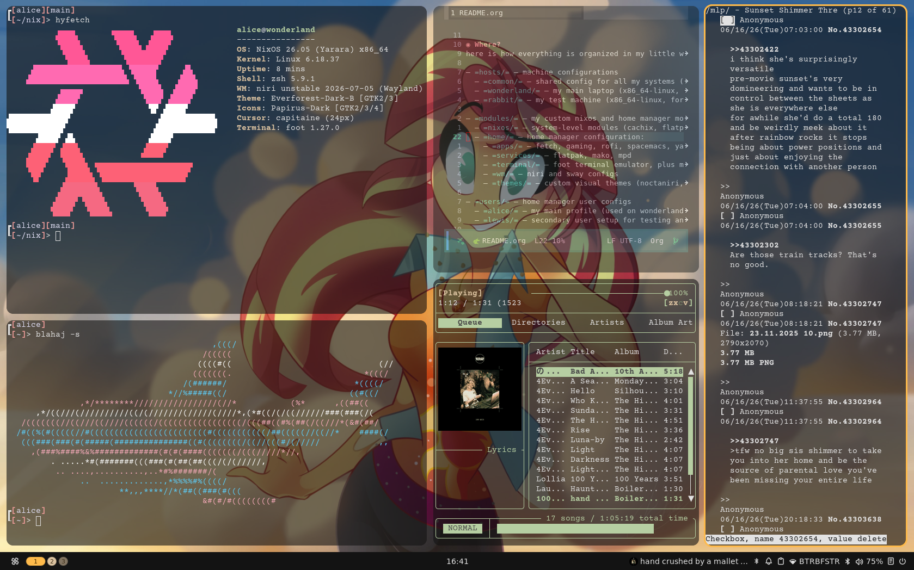

#+author: Alice Liddell
#+options: toc:nil

#+CAPTION: a screenie

* What?
my nixos configuration! this is what runs my cozy daily setup on wonderland (my main laptop) and rabbit (my test machine) ♡

i'm big on declarability, so everything lives here — the desktop shell, the terminal, emacs, even the login greeter. i like niri oh and emacs :3

* Where?
here is how everything is organized:

- =hosts/= — machine configurations
  - =common/= — shared config for all my systems
  - =wonderland/= — my main laptop
  - =rabbit/= — my test machine, for experimenting without breaking things!

- =modules/= — my custom nixos and home manager modules
  - =nixos/= — system level stuff (cachix, podman, the greetd greeter, etc.)
  - =home/= — home manager configuration:
    - =apps/= — browsers, emacs, gaming, yazi, fetch, etc.
    - =services/= — mako, mpd, matugen theming, flatpaks
    - =terminal/= — foot, zsh, zellij, tmux
    - =themes/= — nagare (niri + quickshell), noctaniri, redpine, rosepine-dark

- =users/= — home manager user configs
  - =alice/= — me! (used on wonderland and rabbit)
  - =lewis/= — secondary user for testing and multitasking

- =secrets/= — sops-encrypted secrets

* How?

** Quickstart (for me ofc)
if i ever need to rebuild my system in a hurry:
#+begin_src sh
  git clone https://github.com/petalmaya/nix.git
  cd nix
  nixsw
#+end_src

** Installing on a new machine (or new user setup)
you need your own age key so you can decrypt and re-encrypt the secrets.

*** 1. generate an age key
#+begin_src sh
  age-keygen -o ~/.config/sops/age/keys.txt
  # write down the public key printed - you'll need it!
#+end_src

*** 2. add your public key to .sops.yaml
edit =.sops.yaml= and replace my public key with your own:
#+begin_src yaml
  keys:
    - &admin age1YOUR_PUBLIC_KEY_HERE
  creation_rules:
    - path_regex: secrets/[^/]+\.(yaml|json|env|ini)$
      key_groups:
      - age:
        - *admin
#+end_src

*** 3. create your secrets.yaml
my actual secrets are ignored by git, so you should create your own using the template:
#+begin_src sh
  cp secrets/secrets.yaml.example secrets/secrets.yaml
  sops secrets/secrets.yaml
#+end_src

*** 4. copy your key where sops-nix expects it
before your first rebuild, put the key at =/var/lib/sops-nix/keys.txt= :
#+begin_src sh
  sudo mkdir -p /var/lib/sops-nix
  sudo cp ~/.config/sops/age/keys.txt /var/lib/sops-nix/keys.txt
  sudo chmod 600 /var/lib/sops-nix/keys.txt
#+end_src

*** 5. build!
#+begin_src sh
  sudo nixos-rebuild switch --flake .#wonderland
#+end_src

* Who's Alice?
im alice, silly goose!

* what about the servers?!
i moved most of it to another repo, and even then i've moved off of nixos for them perfering other distros for ease of setting up quickly.
